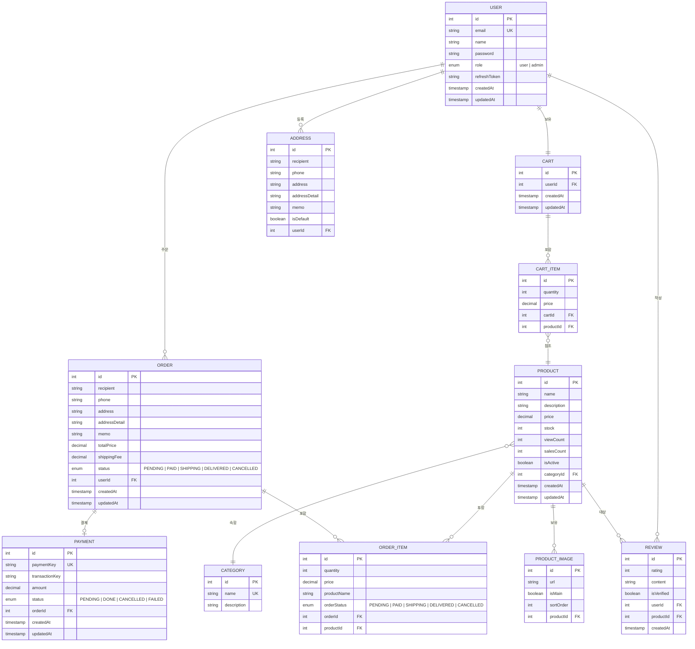
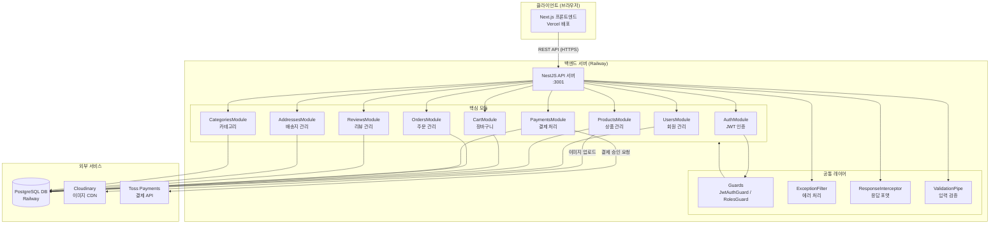
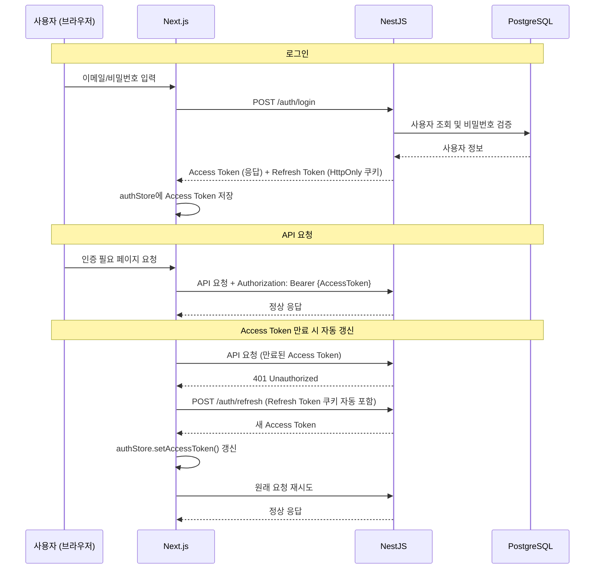
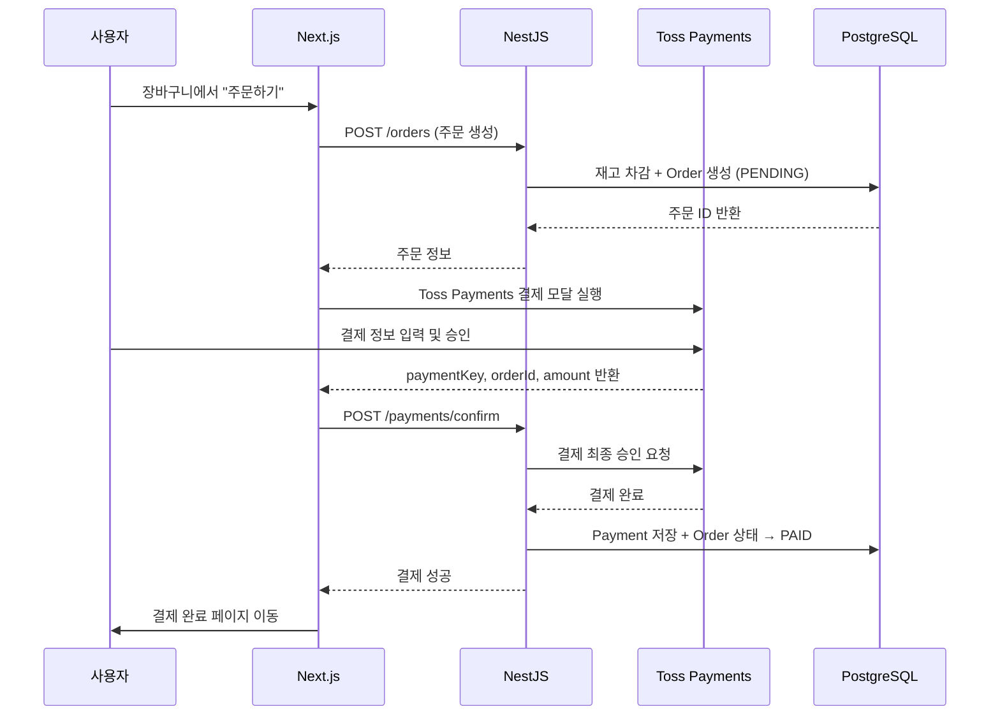

# BlueMe 쇼핑몰 다이어그램

## 1. ERD (Entity Relationship Diagram)

```mermaid
erDiagram
    USER {
        int id PK
        string email UK
        string name
        string password
        enum role "user | admin"
        string refreshToken
        timestamp createdAt
        timestamp updatedAt
    }

    CATEGORY {
        int id PK
        string name UK
        string description
    }

    PRODUCT {
        int id PK
        string name
        string description
        decimal price
        int stock
        int viewCount
        int salesCount
        boolean isActive
        int categoryId FK
        timestamp createdAt
        timestamp updatedAt
    }

    PRODUCT_IMAGE {
        int id PK
        string url
        boolean isMain
        int sortOrder
        int productId FK
    }

    CART {
        int id PK
        int userId FK
        timestamp createdAt
        timestamp updatedAt
    }

    CART_ITEM {
        int id PK
        int quantity
        decimal price
        int cartId FK
        int productId FK
    }

    ORDER {
        int id PK
        string recipient
        string phone
        string address
        string addressDetail
        string memo
        decimal totalPrice
        decimal shippingFee
        enum status "PENDING | PAID | SHIPPING | DELIVERED | CANCELLED"
        int userId FK
        timestamp createdAt
        timestamp updatedAt
    }

    ORDER_ITEM {
        int id PK
        int quantity
        decimal price
        string productName
        enum orderStatus "PENDING | PAID | SHIPPING | DELIVERED | CANCELLED"
        int orderId FK
        int productId FK
    }

    PAYMENT {
        int id PK
        string paymentKey UK
        string transactionKey
        decimal amount
        enum status "PENDING | DONE | CANCELLED | FAILED"
        int orderId FK
        timestamp createdAt
        timestamp updatedAt
    }

    REVIEW {
        int id PK
        int rating
        string content
        boolean isVerified
        int userId FK
        int productId FK
        timestamp createdAt
    }

    ADDRESS {
        int id PK
        string recipient
        string phone
        string address
        string addressDetail
        string memo
        boolean isDefault
        int userId FK
    }

    %% 관계 정의
    USER ||--o{ ORDER : "주문"
    USER ||--|| CART : "보유"
    USER ||--o{ REVIEW : "작성"
    USER ||--o{ ADDRESS : "등록"

    CART ||--o{ CART_ITEM : "포함"
    CART_ITEM }o--|| PRODUCT : "참조"

    PRODUCT }o--|| CATEGORY : "속함"
    PRODUCT ||--o{ PRODUCT_IMAGE : "보유"
    PRODUCT ||--o{ ORDER_ITEM : "포함"
    PRODUCT ||--o{ REVIEW : "대상"

    ORDER ||--o{ ORDER_ITEM : "포함"
    ORDER ||--o| PAYMENT : "결제"
```

---

## 2. 시스템 아키텍처

```mermaid
graph TB
    subgraph Client["클라이언트 (브라우저)"]
        FE["Next.js 프론트엔드<br/>Vercel 배포"]
    end

    subgraph Backend["백엔드 서버 (Railway)"]
        API["NestJS API 서버<br/>:3001"]

        subgraph Modules["핵심 모듈"]
            AUTH["AuthModule<br/>JWT 인증"]
            USERS["UsersModule<br/>회원 관리"]
            PRODUCTS["ProductsModule<br/>상품 관리"]
            CART["CartModule<br/>장바구니"]
            ORDERS["OrdersModule<br/>주문 관리"]
            PAYMENTS["PaymentsModule<br/>결제 처리"]
            REVIEWS["ReviewsModule<br/>리뷰 관리"]
            ADDRESSES["AddressesModule<br/>배송지 관리"]
            CATEGORIES["CategoriesModule<br/>카테고리"]
        end

        subgraph Common["공통 레이어"]
            GUARD["Guards<br/>JwtAuthGuard / RolesGuard"]
            FILTER["ExceptionFilter<br/>에러 처리"]
            INTERCEPTOR["ResponseInterceptor<br/>응답 포맷"]
            PIPE["ValidationPipe<br/>입력 검증"]
        end
    end

    subgraph External["외부 서비스"]
        DB[("PostgreSQL DB<br/>Railway")]
        CLOUDINARY["Cloudinary<br/>이미지 CDN"]
        TOSS["Toss Payments<br/>결제 API"]
    end

    FE -->|"REST API (HTTPS)"| API
    API --> AUTH
    API --> USERS
    API --> PRODUCTS
    API --> CART
    API --> ORDERS
    API --> PAYMENTS
    API --> REVIEWS
    API --> ADDRESSES
    API --> CATEGORIES

    AUTH --> GUARD
    GUARD --> Modules

    API --> FILTER
    API --> INTERCEPTOR
    API --> PIPE

    USERS --> DB
    PRODUCTS --> DB
    CART --> DB
    ORDERS --> DB
    PAYMENTS --> DB
    REVIEWS --> DB
    ADDRESSES --> DB
    CATEGORIES --> DB

    PRODUCTS -->|"이미지 업로드"| CLOUDINARY
    PAYMENTS -->|"결제 승인 요청"| TOSS
```

---

## 3. 인증 플로우

```mermaid
sequenceDiagram
    participant U as 사용자 (브라우저)
    participant FE as Next.js
    participant API as NestJS
    participant DB as PostgreSQL

    Note over U,DB: 로그인
    U->>FE: 이메일/비밀번호 입력
    FE->>API: POST /auth/login
    API->>DB: 사용자 조회 및 비밀번호 검증
    DB-->>API: 사용자 정보
    API-->>FE: Access Token (응답) + Refresh Token (HttpOnly 쿠키)
    FE->>FE: authStore에 Access Token 저장

    Note over U,DB: API 요청
    U->>FE: 인증 필요 페이지 요청
    FE->>API: API 요청 + Authorization: Bearer {AccessToken}
    API-->>FE: 정상 응답

    Note over U,DB: Access Token 만료 시 자동 갱신
    FE->>API: API 요청 (만료된 Access Token)
    API-->>FE: 401 Unauthorized
    FE->>API: POST /auth/refresh (Refresh Token 쿠키 자동 포함)
    API-->>FE: 새 Access Token
    FE->>FE: authStore.setAccessToken() 갱신
    FE->>API: 원래 요청 재시도
    API-->>FE: 정상 응답
```

---

## 4. 주문/결제 플로우

```mermaid
sequenceDiagram
    participant U as 사용자
    participant FE as Next.js
    participant API as NestJS
    participant TOSS as Toss Payments
    participant DB as PostgreSQL

    U->>FE: 장바구니에서 "주문하기"
    FE->>API: POST /orders (주문 생성)
    API->>DB: 재고 차감 + Order 생성 (PENDING)
    DB-->>API: 주문 ID 반환
    API-->>FE: 주문 정보

    FE->>TOSS: Toss Payments 결제 모달 실행
    U->>TOSS: 결제 정보 입력 및 승인
    TOSS-->>FE: paymentKey, orderId, amount 반환

    FE->>API: POST /payments/confirm
    API->>TOSS: 결제 최종 승인 요청
    TOSS-->>API: 결제 완료
    API->>DB: Payment 저장 + Order 상태 → PAID
    API-->>FE: 결제 성공

    FE->>U: 결제 완료 페이지 이동
```

---

## 5. 프론트엔드 라우팅 구조

```mermaid
graph TD
    ROOT["/"]

    ROOT --> MAIN["(main) 그룹<br/>Header + Footer 포함"]
    ROOT --> AUTH_GROUP["auth 그룹<br/>인증 레이아웃"]
    ROOT --> ADMIN_GROUP["admin 그룹<br/>관리자 레이아웃"]

    MAIN --> HOME["/ 홈페이지<br/>랭킹·트렌딩 상품"]
    MAIN --> PRODUCTS_LIST["/products<br/>상품 목록"]
    MAIN --> PRODUCT_DETAIL["/products/[id]<br/>상품 상세"]
    MAIN --> CART["/cart<br/>장바구니"]
    MAIN --> CHECKOUT["/checkout<br/>결제 페이지"]
    MAIN --> CHECKOUT_SUCCESS["/checkout/success<br/>결제 완료"]
    MAIN --> CHECKOUT_FAIL["/checkout/fail<br/>결제 실패"]
    MAIN --> MYPAGE["/mypage<br/>마이페이지"]
    MAIN --> MYPAGE_PROFILE["/mypage/profile<br/>프로필 수정"]
    MAIN --> MYPAGE_ORDERS["/mypage/orders<br/>주문 내역"]
    MAIN --> MYPAGE_ORDER_DETAIL["/mypage/orders/[id]<br/>주문 상세"]
    MAIN --> MYPAGE_ADDRESS["/mypage/address<br/>배송지 관리"]
    MAIN --> BRANDS["/brands 준비 중"]
    MAIN --> SALE["/sale 준비 중"]
    MAIN --> EVENT["/event 준비 중"]

    AUTH_GROUP --> LOGIN["/auth/login<br/>로그인"]
    AUTH_GROUP --> SIGNUP["/auth/signup<br/>회원가입"]

    ADMIN_GROUP --> ADMIN_DASH["/admin<br/>대시보드"]
    ADMIN_GROUP --> ADMIN_PRODUCTS["/admin/products<br/>상품 관리"]
    ADMIN_GROUP --> ADMIN_PRODUCTS_NEW["/admin/products/new<br/>상품 등록"]
    ADMIN_GROUP --> ADMIN_PRODUCTS_EDIT["/admin/products/[id]/edit<br/>상품 수정"]
    ADMIN_GROUP --> ADMIN_ORDERS["/admin/orders<br/>주문 관리"]
    ADMIN_GROUP --> ADMIN_USERS["/admin/users<br/>회원 관리"]
```
