# BlueMe — 화장품 쇼핑몰

> Next.js + NestJS 기반 풀스택 화장품 e-커머스 프로젝트

**🔗 배포 링크: [https://blueme.vercel.app](https://blueme.vercel.app)**

### 테스트 계정

| 구분 | 이메일 | 비밀번호 |
|------|--------|----------|
| 일반 사용자 | test@test.com | test1234 |
| 관리자 | admin@test.com | admin1234 |

<br/>

## 목차

1. [프로젝트 소개](#1-프로젝트-소개)
2. [기술 스택](#2-기술-스택)
3. [주요 기능](#3-주요-기능)
4. [화면 구성](#4-화면-구성)
5. [시스템 아키텍처](#5-시스템-아키텍처)
6. [ERD](#6-erd)
7. [API 명세](#7-api-명세)
8. [트러블슈팅](#8-트러블슈팅)
9. [로컬 실행 방법](#9-로컬-실행-방법)

<br/>

## 1. 프로젝트 소개

회원가입부터 상품 탐색, 장바구니, 결제, 주문 관리까지 e-커머스의 전체 흐름을 직접 구현한 풀스택 프로젝트입니다.

단순한 CRUD를 넘어 **JWT 기반 인증(Access/Refresh Token 이중 구조)**, **Toss Payments 실 결제 연동**, **Cloudinary 이미지 업로드**, **관리자 대시보드** 등 실서비스에 가까운 기능을 구현했습니다.

배포 과정에서 발생한 크로스 도메인 쿠키 문제, CORS 설정, Next.js 빌드 에러 등 실제 운영 환경의 이슈를 직접 해결하며 개발 역량을 쌓았습니다.

| 구분 | 내용 |
|------|------|
| 개발 기간 | 개인 프로젝트 |
| 배포 환경 | Vercel (Frontend) + Railway (Backend, PostgreSQL) |

<br/>

## 2. 기술 스택

### Frontend


### Backend


### 외부 서비스


<br/>

## 3. 주요 기능

### 사용자
| 기능 | 설명 |
|------|------|
| 회원가입 / 로그인 | JWT Access Token(15분) + Refresh Token(7일, HttpOnly 쿠키) 이중 인증 |
| 토큰 자동 갱신 | Access Token 만료 시 Axios Interceptor가 자동으로 갱신 후 원래 요청 재시도 |
| 상품 탐색 | 카테고리 필터, 키워드 검색, 실시간 랭킹(판매순), 트렌딩(조회순) |
| 장바구니 | 상품 추가/수량 변경/삭제, 로그인 시 서버 장바구니 동기화, 담기 완료 모달(계속 쇼핑/장바구니 보기) |
| 결제 | Toss Payments 카드 결제, 30,000원 이상 무료배송, 재고 부족 시 인라인 에러 표시 |
| 바로 구매 | 장바구니 없이 상품 상세에서 즉시 결제 |
| 주문·배송 조회 | 주문 목록과 배송 단계(주문완료 → 결제완료 → 배송중 → 배송완료) 시각화 |
| 주문 취소 | 주문완료/결제완료 상태에서 취소 가능, 취소 시 재고 자동 복구 |
| 재주문 | 기존 주문 상품을 장바구니에 담아 바로 결제 페이지로 이동 |
| 마이페이지 | 주문 내역 조회, 프로필 수정, 배송지 관리 |
| 리뷰 | 구매 확인 후 리뷰 작성 가능 (구매하지 않은 상품은 작성 불가) |

### 관리자
| 기능 | 설명 |
|------|------|
| 대시보드 | 총 주문수, 총 매출, 대기 주문 수 통계 |
| 상품 관리 | 상품 등록/수정/삭제, 이미지 다중 업로드 (Cloudinary CDN) |
| 주문 관리 | 전체 주문 조회, 주문 상태 변경 (pending → paid → shipping → delivered) |
| 회원 관리 | 전체 회원 목록 조회 |

### 기타
| 기능 | 설명 |
|------|------|
| 404 페이지 | 존재하지 않는 경로 접근 시 안내 페이지 표시 |
| 준비 중 페이지 | 미구현 서비스(특가/세일, 기획전, 브랜드, 이벤트, 고객센터) 안내 |
| 로딩 스켈레톤 | 상품 목록 등 데이터 로딩 중 스켈레톤 UI 표시 |

<br/>

## 4. 화면 구성

> 스크린샷을 추가해 주세요 (`docs/screenshots/` 폴더에 이미지를 넣고 아래 경로를 수정하세요)

| 홈 (랭킹/트렌딩) | 상품 목록 |
|:---:|:---:|
| 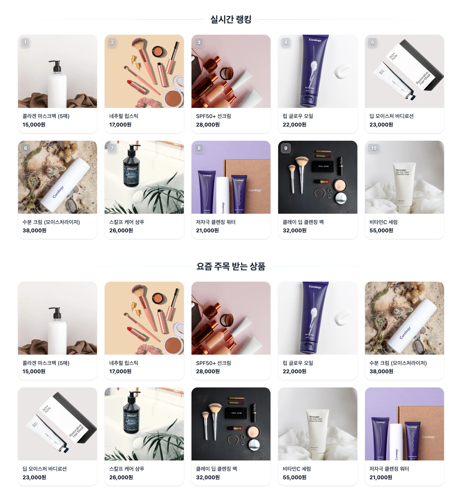 | 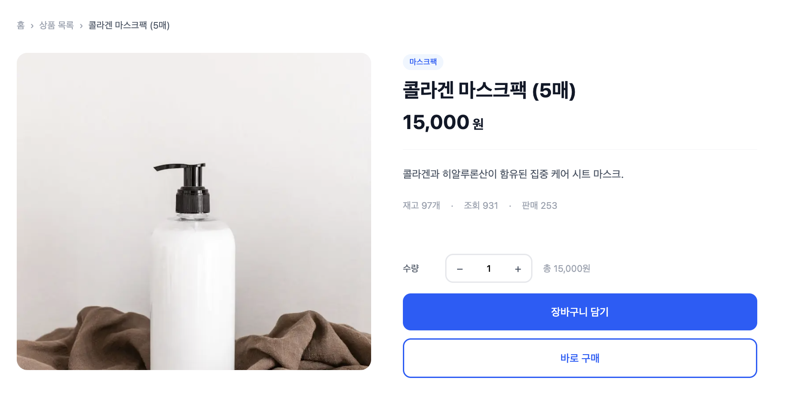 |

| 상품 상세 / 리뷰 | 장바구니 |
|:---:|:---:|
| 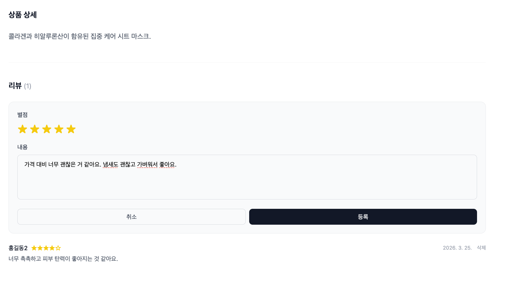 | 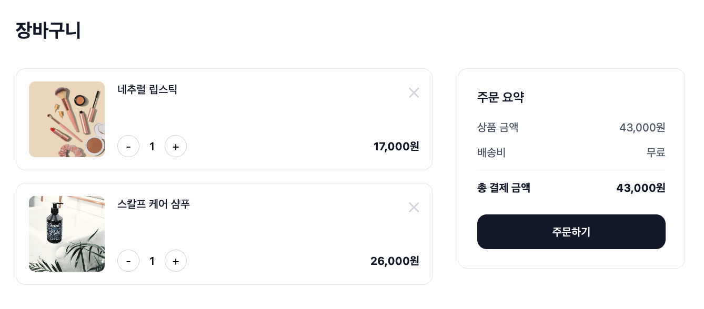 |

| 결제 (Toss Payments) | 마이페이지 |
|:---:|:---:|
| 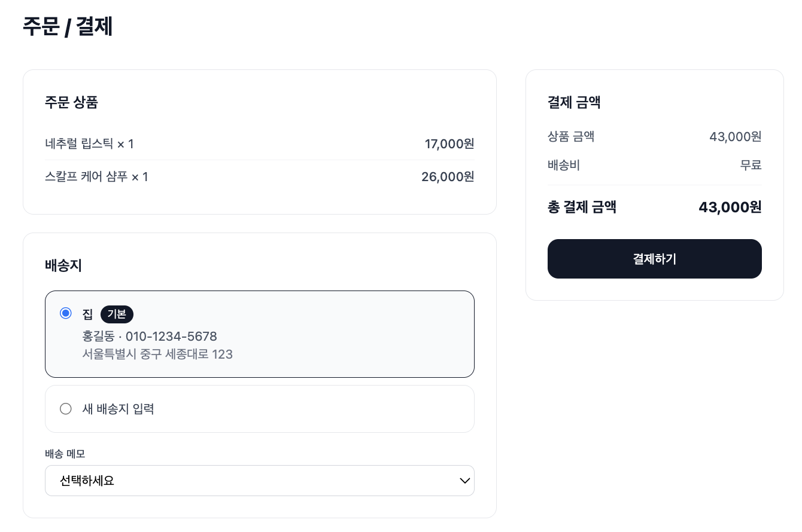 | 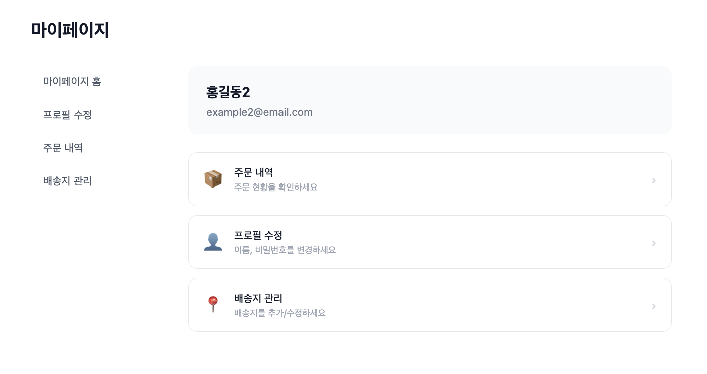 |

| 관리자 대시보드 | 상품 관리 |
|:---:|:---:|
| 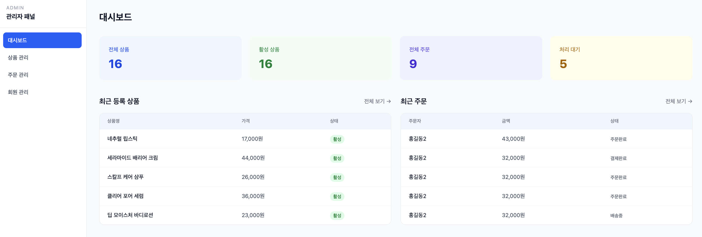 | 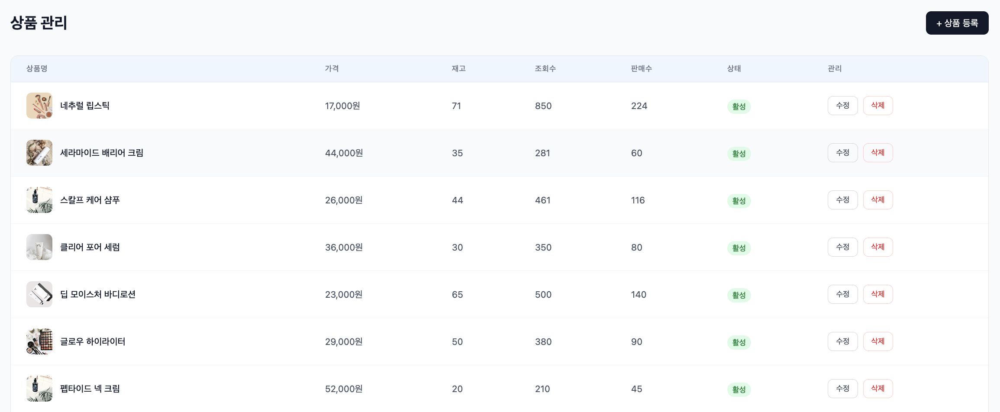 |

| 주문 내역 (사용자) | 주문 관리 (관리자) |
|:---:|:---:|
| 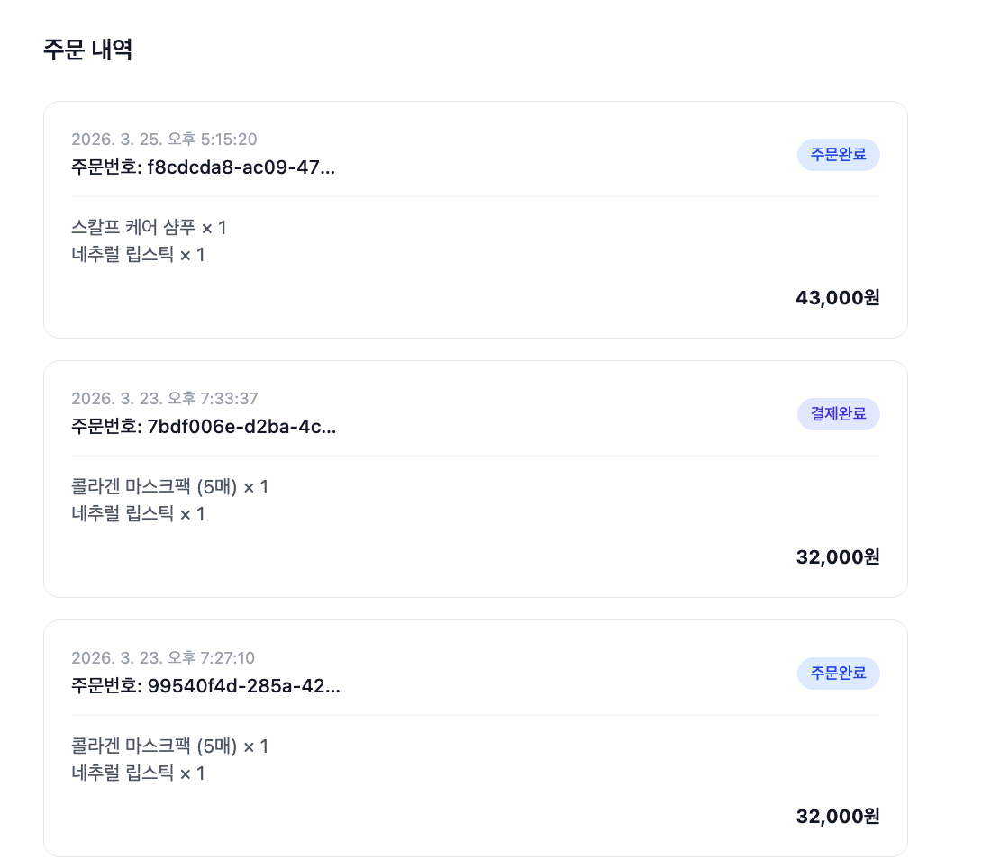 | 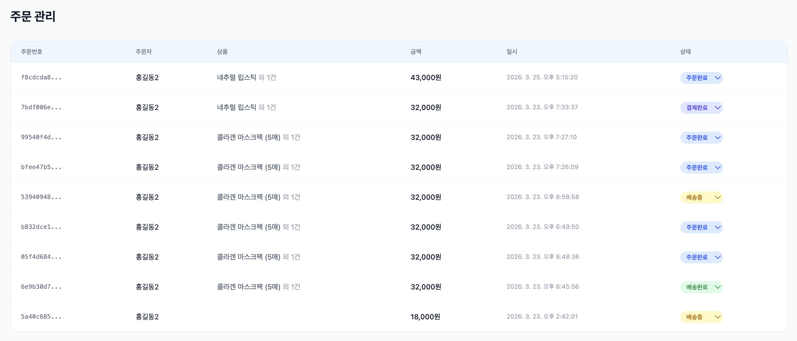 |

<br/>

## 5. 시스템 아키텍처


### 인증 흐름 (Auth Flow)

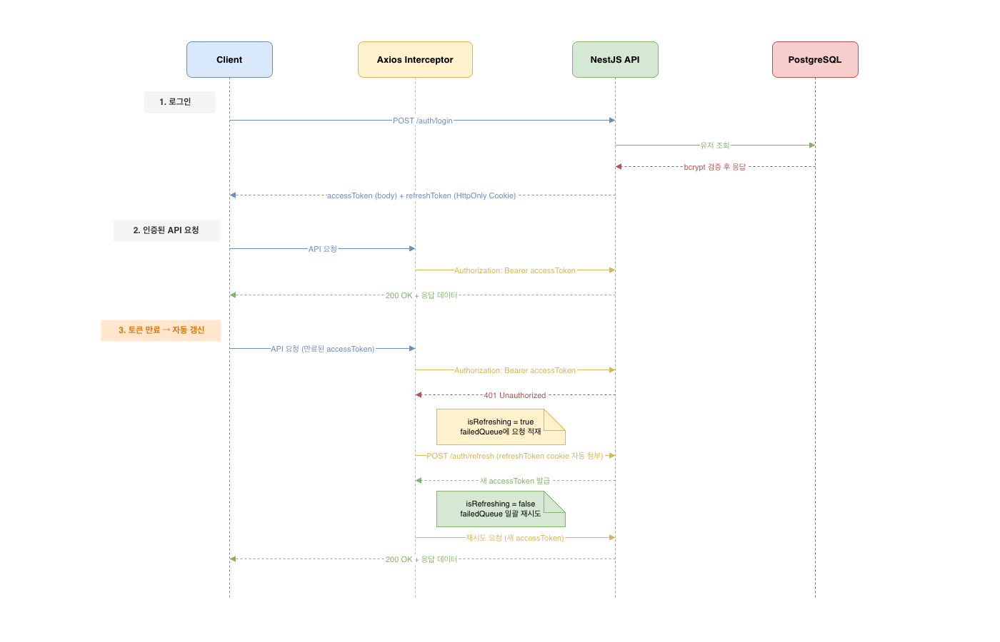

<br/>

## 6. ERD


<br/>

## 7. API 명세

### 인증 (Auth)
| Method | URL | 설명 | 인증 |
|--------|-----|------|------|
| POST | `/auth/signup` | 회원가입 | - |
| POST | `/auth/login` | 로그인 | - |
| POST | `/auth/refresh` | 토큰 갱신 | RefreshToken (쿠키) |
| POST | `/auth/logout` | 로그아웃 | JWT |

### 상품 (Products)
| Method | URL | 설명 | 인증 |
|--------|-----|------|------|
| GET | `/products` | 상품 목록 (`?q=검색어&category=카테고리`) | - |
| GET | `/products/ranking` | 실시간 랭킹 (판매순 상위 10) | - |
| GET | `/products/trending` | 트렌딩 (조회순 상위 10) | - |
| GET | `/products/:id` | 상품 상세 (viewCount +1) | - |
| GET | `/products/admin` | 전체 상품 목록 (비활성 포함) | JWT + Admin |
| POST | `/products` | 상품 생성 | JWT + Admin |
| POST | `/products/upload` | 이미지 업로드 (Cloudinary) | JWT + Admin |
| PATCH | `/products/:id` | 상품 수정 | JWT + Admin |
| DELETE | `/products/:id` | 상품 삭제 | JWT + Admin |

### 장바구니 (Cart)
| Method | URL | 설명 | 인증 |
|--------|-----|------|------|
| GET | `/cart` | 장바구니 조회 (없으면 자동 생성) | JWT |
| POST | `/cart/items` | 상품 추가 (기존 상품이면 수량 증가) | JWT |
| PATCH | `/cart/items/:id` | 수량 변경 | JWT |
| DELETE | `/cart/items/:id` | 아이템 삭제 | JWT |

### 주문 (Orders)
| Method | URL | 설명 | 인증 |
|--------|-----|------|------|
| POST | `/orders` | 주문 생성 (장바구니 → 주문, 장바구니 자동 비움) | JWT |
| GET | `/orders/my` | 내 주문 목록 | JWT |
| GET | `/orders/:id` | 주문 상세 | JWT |
| GET | `/orders/admin/all` | 전체 주문 목록 | JWT + Admin |
| GET | `/orders/admin/stats` | 주문 통계 | JWT + Admin |
| PATCH | `/orders/:id/status` | 주문 상태 변경 | JWT + Admin |

### 결제 (Payments)
| Method | URL | 설명 | 인증 |
|--------|-----|------|------|
| POST | `/payments/confirm` | Toss Payments 결제 승인 | JWT |

### 리뷰 (Reviews)
| Method | URL | 설명 | 인증 |
|--------|-----|------|------|
| GET | `/reviews?productId=...` | 상품 리뷰 목록 | - |
| POST | `/reviews` | 리뷰 작성 (구매 확인 필요) | JWT |
| DELETE | `/reviews/:id` | 리뷰 삭제 (본인만) | JWT |

### 배송지 (Addresses)
| Method | URL | 설명 | 인증 |
|--------|-----|------|------|
| GET | `/addresses` | 내 배송지 목록 (기본 배송지 우선) | JWT |
| POST | `/addresses` | 배송지 추가 (최초 추가 시 자동으로 기본 설정) | JWT |
| PATCH | `/addresses/:id/default` | 기본 배송지 변경 | JWT |
| DELETE | `/addresses/:id` | 배송지 삭제 | JWT |

<br/>

## 8. 트러블슈팅

### 1. 배포 환경에서 Refresh Token 쿠키 전송 실패

**문제**

로컬에서는 정상 동작하던 자동 토큰 갱신 기능이 배포 환경(Vercel + Railway)에서 동작하지 않았습니다. 분석 결과, 프론트엔드(blueme.vercel.app)와 백엔드(Railway 도메인)가 서로 다른 도메인이어서 **SameSite 정책**에 의해 HttpOnly 쿠키가 전송되지 않는 것이 원인이었습니다.

**해결**

```typescript
// backend: 쿠키 설정
res.cookie('refresh_token', refreshToken, {
  httpOnly: true,
  secure: isProduction,          // HTTPS 환경에서만 전송
  sameSite: isProduction ? 'none' : 'lax', // 크로스 도메인 허용
  maxAge: 7 * 24 * 60 * 60 * 1000,
});

// backend: CORS 설정
app.enableCors({
  origin: ['http://localhost:3000', 'https://blueme.vercel.app'],
  credentials: true,  // 쿠키 허용
});

// frontend: Axios 설정
const api = axios.create({
  withCredentials: true, // 쿠키 자동 전송
});
```

`sameSite: 'none'`은 반드시 `secure: true`와 함께 사용해야 합니다. 이를 통해 HTTPS 크로스 도메인 환경에서도 쿠키가 정상 전송됩니다.

---

### 2. Next.js Middleware에서 인증 쿠키 읽기 실패

**문제**

로그인 후 보호된 라우트에 접근할 때 미들웨어가 인증 여부를 확인하지 못해 로그인한 사용자가 로그인 페이지로 리다이렉트되는 문제가 발생했습니다.

Next.js 미들웨어는 **Edge Runtime**에서 실행되므로, HttpOnly 쿠키에 접근하는 것이 불가능합니다. 따라서 Refresh Token으로 인증 여부를 판별할 수 없었습니다.

**해결**

인증 상태 확인용 쿠키(`is_authenticated`, `user_role`)를 별도로 발급하는 방식으로 해결했습니다.

```typescript
// frontend: 로그인 성공 시 미들웨어용 쿠키 발급
const setAuthCookie = (role: string) => {
  document.cookie = `is_authenticated=1; path=/; max-age=${7 * 24 * 60 * 60}`;
  document.cookie = `user_role=${role}; path=/; max-age=${7 * 24 * 60 * 60}`;
};

// middleware.ts: 해당 쿠키로 인증 상태 확인
const isAuthenticated = request.cookies.get('is_authenticated')?.value === '1';
const userRole = request.cookies.get('user_role')?.value;
```

HttpOnly가 아닌 일반 쿠키이므로 보안상 민감한 정보(토큰 등)는 담지 않고, 인증 여부와 역할만 저장했습니다.

---

### 3. NestJS 동적 라우트 순서 문제

**문제**

`GET /products/ranking` 요청이 `GET /products/:id`로 매칭되어 "ranking"이라는 ID를 가진 상품을 조회하다가 404 에러가 발생했습니다.

**해결**

NestJS 컨트롤러에서 문자열 고정 경로는 동적 파라미터 경로보다 반드시 앞에 선언해야 합니다.

```typescript
@Controller('products')
export class ProductsController {
  @Get('ranking')   // ✅ 반드시 먼저 선언
  getRanking() { ... }

  @Get('trending')  // ✅ 반드시 먼저 선언
  getTrending() { ... }

  @Get(':id')       // 동적 라우트는 마지막에
  findOne(@Param('id') id: string) { ... }
}
```

---

### 4. Axios 동시 요청 시 토큰 중복 갱신 문제

**문제**

Access Token이 만료된 상태에서 여러 API 요청이 동시에 발생하면, 각 요청이 모두 `/auth/refresh`를 호출해 Refresh Token이 여러 번 재발급되고 앞서 발급된 토큰이 무효화되는 Race Condition이 발생했습니다.

**해결**

`isRefreshing` 플래그와 `failedQueue`를 사용해 갱신 요청을 단 한 번만 수행하도록 제어했습니다.

```typescript
let isRefreshing = false;
let failedQueue: Array<{ resolve: Function; reject: Function }> = [];

api.interceptors.response.use(null, async (error) => {
  if (error.response?.status === 401) {
    if (isRefreshing) {
      // 갱신 중이면 큐에 추가하고 대기
      return new Promise((resolve, reject) => {
        failedQueue.push({ resolve, reject });
      });
    }

    isRefreshing = true;
    try {
      const { data } = await api.post('/auth/refresh');
      // 대기 중인 요청들 일괄 재시도
      failedQueue.forEach(({ resolve }) => resolve(data.accessToken));
      return api(error.config); // 원래 요청 재시도
    } catch {
      failedQueue.forEach(({ reject }) => reject(error));
      logout();
    } finally {
      isRefreshing = false;
      failedQueue = [];
    }
  }
});
```

---

### 5. 주문 생성 시 재고 차감 누락

**문제**

주문이 생성되어도 상품 재고(stock)가 차감되지 않아 재고 이상으로 주문이 가능했습니다. 또한 주문 취소 시에도 재고가 복구되지 않았습니다.

**해결**

주문 생성 시 재고 부족 여부를 먼저 검증한 뒤, 주문 확정 시 재고를 차감하고 판매수를 증가시킵니다. 주문 취소 시에는 반대로 재고를 복구하고 판매수를 감소시킵니다.

```typescript
// 재고 부족 검증
const outOfStockItems = cart.items.filter((item) => item.product.stock < item.quantity);
if (outOfStockItems.length > 0) throw new BadRequestException('재고가 부족한 상품이 있습니다.');

// 주문 확정 시 재고 차감
await this.productRepository.decrement({ id: item.product.id }, 'stock', item.quantity);
await this.productRepository.increment({ id: item.product.id }, 'salesCount', item.quantity);

// 주문 취소 시 재고 복구
await this.productRepository.increment({ id: item.product.id }, 'stock', item.quantity);
await this.productRepository.decrement({ id: item.product.id }, 'salesCount', item.quantity);
```

---

### 7. TypeORM eager 로딩과 명시적 relations 충돌로 이미지 미조회

**문제**

주문 상세 페이지에서 상품 이미지가 표시되지 않았습니다. `OrderItem` 엔티티의 `product` 관계에 `eager: true`가 설정되어 있어 TypeORM이 product를 자동으로 로드하지만, 이 경우 nested relation인 `product.images`는 포함되지 않습니다. Service에서 `relations: ['items.product.images']`를 명시해도 eager 로딩과 충돌하여 images가 조회되지 않았습니다.

**해결**

`OrderItem` 엔티티에서 `eager: true`를 제거했습니다. Service에서 이미 명시적으로 relations를 지정하고 있으므로 eager 설정이 불필요했고, 제거 후 `items.product.images`가 정상적으로 조회됩니다.

```typescript
// 수정 전
@ManyToOne(() => Product, { nullable: true, onDelete: 'SET NULL', eager: true })
product: Product | null;

// 수정 후
@ManyToOne(() => Product, { nullable: true, onDelete: 'SET NULL' })
product: Product | null;
```

---

### 8. Toss Payments customerKey 오용으로 결제 오류 발생

**문제**

`customerKey`에 사용자 ID 대신 주문 ID(`user_${order.id}`)를 사용했습니다. Toss SDK 스펙상 `customerKey`는 결제 수단을 저장·관리하는 고객 식별자이므로, 주문마다 다른 값이 들어오면 SDK 내부에서 오류가 발생했습니다. 또한 에러 발생 시 SDK 오버레이만 뜨고 닫기 버튼이 없어 사용자가 페이지를 벗어날 수 없었습니다.

**해결**

`customerKey`를 로그인한 사용자의 ID 기반으로 고정하고, 결제 실패 시 `alert()` 대신 fail 페이지로 redirect하도록 수정했습니다.

```typescript
// 수정 전
const payment = toss.payment({ customerKey: `user_${order.id}` });

// 수정 후
const payment = toss.payment({ customerKey: `user_${user?.id}` });

// 에러 처리: alert → fail 페이지 redirect
} catch (err: any) {
  if (err?.code !== 'USER_CANCEL') {
    const message = err?.message ?? '오류가 발생했습니다.';
    router.push(`/checkout/fail?message=${encodeURIComponent(message)}`);
  }
}
```

---

### 9. 판매 중단 상품이 장바구니에서 주문 가능

**문제**

`isActive: false`로 설정된 판매 중단 상품이 장바구니에 담겨있는 경우, 주문 생성 시 재고 검증만 있고 활성 상태 검증이 없어 그대로 주문이 생성되는 문제가 있었습니다.

**해결**

주문 생성 시 재고 부족 검증과 함께 비활성 상품 체크를 추가했습니다.

```typescript
// 비활성 상품 체크
const inactiveItems = cart.items.filter((item) => !item.product.isActive);
if (inactiveItems.length > 0) {
  const names = inactiveItems.map((item) => item.product.name).join(', ');
  throw new BadRequestException(`현재 판매 중단된 상품이 있습니다: ${names}`);
}
```

---

### 10. Next.js App Router 빌드 에러 (useSearchParams Suspense 누락)

**문제**

`useSearchParams()`를 사용하는 로그인 페이지에서 `yarn build` 시 빌드가 실패했습니다. Next.js App Router에서 `useSearchParams()`는 `<Suspense>` 경계 안에서만 사용 가능하며, 없으면 빌드 단계에서 에러가 발생합니다.

**해결**

`useSearchParams()`를 사용하는 컴포넌트를 분리하고 `<Suspense>`로 감쌌습니다.

```typescript
// 수정 전: useSearchParams를 페이지 컴포넌트에서 직접 사용
export default function LoginPage() {
  const searchParams = useSearchParams(); // ❌ 빌드 에러
  ...
}

// 수정 후: Suspense로 감싸기
function LoginForm() {
  const searchParams = useSearchParams(); // ✅
  ...
}

export default function LoginPage() {
  return (
    <Suspense>
      <LoginForm />
    </Suspense>
  );
}
```

---

### 11. isMain과 sortOrder 이중 기준으로 대표 이미지 불일치

**문제**

상품 대표 이미지를 결정하는 기준이 `isMain` 필드와 `sortOrder` 두 가지로 나뉘어 있었습니다. 이미지 등록 시 `isMain`은 업데이트되지 않거나 `sortOrder`와 다른 이미지를 가리키는 경우가 발생해 프론트엔드에서 대표 이미지가 일관되지 않게 표시됐습니다.

**해결**

`isMain` 필드를 엔티티에서 제거하고 `sortOrder: 0`인 이미지를 대표 이미지로 통일했습니다. 기준이 하나로 줄어 이미지 관련 로직이 단순해졌습니다.

```typescript
// 수정 전: isMain으로 대표 이미지 판별
const mainImage = product.images.find((img) => img.isMain);

// 수정 후: sortOrder 기준으로 통일
const mainImage = product.images.sort((a, b) => a.sortOrder - b.sortOrder)[0];
```

---

### 12. 로딩 중 빈 화면 노출

**문제**

상품 목록 페이지에서 데이터를 불러오는 동안 아무것도 표시되지 않아 사용자가 페이지가 멈춘 것으로 오해할 수 있었습니다.

**해결**

Next.js App Router의 `loading.tsx` 컨벤션을 활용해 스켈레톤 UI를 적용했습니다. 페이지와 동일한 레이아웃 구조를 유지하면서 `animate-pulse`로 부드러운 로딩 애니메이션을 표시합니다.

```typescript
// app/(main)/products/loading.tsx
export default function ProductsLoading() {
  return (
    <div className="max-w-6xl mx-auto px-4 py-8">
      <div className="flex gap-2 mb-8 animate-pulse">
        {[...Array(6)].map((_, i) => (
          <div key={i} className="h-8 w-20 bg-gray-100 rounded-full" />
        ))}
      </div>
      <div className="grid grid-cols-2 sm:grid-cols-3 lg:grid-cols-4 gap-5">
        {[...Array(12)].map((_, i) => (
          <div key={i} className="animate-pulse">
            <div className="aspect-square bg-gray-100 rounded-xl mb-3" />
            <div className="h-4 bg-gray-100 rounded w-3/4 mb-2" />
            <div className="h-4 bg-gray-100 rounded w-1/2" />
          </div>
        ))}
      </div>
    </div>
  );
}
```

별도 로딩 상태 관리 없이 파일 하나로 해결되며, Suspense 경계가 자동으로 적용됩니다.

---

### 13. 장바구니 담기 후 UX 단절

**문제**

상품을 장바구니에 담으면 곧바로 장바구니 페이지로 이동했습니다. 여러 상품을 연속으로 담으려는 사용자가 매번 상품 상세 페이지로 되돌아가야 하는 불편함이 있었습니다.

**해결**

장바구니 담기 성공 시 페이지 이동 대신 모달을 표시하고, 사용자가 "계속 쇼핑" 또는 "장바구니 보기"를 직접 선택하도록 변경했습니다.

```typescript
// 수정 전: 담기 성공 시 바로 페이지 이동
await addItem(product.id, qty);
router.push('/cart');

// 수정 후: 모달로 사용자 선택 유도
const [showModal, setShowModal] = useState(false);

await addItem(product.id, qty);
setShowModal(true);

{showModal && (
  <div className="fixed inset-0 z-50 flex items-center justify-center">
    <div className="absolute inset-0 bg-black/30" onClick={() => setShowModal(false)} />
    <div className="relative bg-white rounded-2xl p-8 w-80 text-center shadow-xl">
      <h3 className="text-base font-bold text-gray-900 mb-1">장바구니에 담았습니다</h3>
      <div className="flex gap-2">
        <button onClick={() => setShowModal(false)}>계속 쇼핑</button>
        <button onClick={() => router.push('/cart')}>장바구니 보기</button>
      </div>
    </div>
  </div>
)}
```

---

### 14. 재고 부족을 결제 단계에서야 인지

**문제**

장바구니에 담긴 상품의 재고가 부족해도 결제 버튼을 눌러 주문 생성 요청을 보내기 전까지 사용자가 이를 알 수 없었습니다. 에러 발생 시 `alert()`로만 처리해 UX가 좋지 않았습니다.

**해결**

백엔드에서 주문 생성 시 재고를 검증하고, 프론트엔드에서는 에러 메시지를 `alert()` 대신 결제 폼 내 인라인으로 표시했습니다.

```typescript
// backend: 주문 생성 시 재고 검증
const outOfStockItems = cart.items.filter((item) => item.product.stock < item.quantity);
if (outOfStockItems.length > 0) throw new BadRequestException('재고가 부족한 상품이 있습니다.');

// frontend: 인라인 에러 표시
const [errorMsg, setErrorMsg] = useState<string | null>(null);

try {
  await api.post('/orders', delivery);
} catch (err: any) {
  if (err?.response?.data?.message) {
    setErrorMsg(err.response.data.message); // alert 대신 인라인 표시
    return;
  }
}

{errorMsg && (
  <p className="text-xs text-red-500 text-center mb-3">{errorMsg}</p>
)}
```

---

### 15. 새로고침 시 필터 상태 초기화

**문제**

카테고리나 정렬 필터를 선택한 뒤 페이지를 새로고침하거나 뒤로가기를 하면 필터 상태가 초기화됐습니다. React 상태(useState)로만 관리하고 있어 URL에 반영되지 않는 것이 원인이었습니다.

**해결**

`useState` 대신 `useSearchParams`와 `useRouter`를 사용해 필터 상태를 URL 쿼리스트링으로 관리했습니다. 필터 변경 시 URL이 업데이트되어 새로고침, 뒤로가기, 링크 공유 시에도 상태가 유지됩니다.

```typescript
// 수정 전: useState로 관리 → 새로고침 시 초기화
const [category, setCategory] = useState('');

// 수정 후: URL 쿼리스트링으로 관리
const router = useRouter();
const searchParams = useSearchParams();
const currentCategory = searchParams.get('category') ?? '';

function updateParam(key: string, value: string | null) {
  const params = new URLSearchParams(searchParams.toString());
  if (value) params.set(key, value);
  else params.delete(key);
  router.push(`/products?${params.toString()}`);
}
// /products?category=스킨케어&sort=price_asc → 새로고침해도 유지
```

서버 컴포넌트에서도 `searchParams`로 동일한 값을 읽어 SSR 시 필터가 적용된 상태로 렌더링됩니다.

---

### 16. 주문 상태를 텍스트로만 표시해 진행 상황 파악 어려움

**문제**

주문 목록에서 배송 상태가 `"shipping"` 같은 텍스트 뱃지로만 표시되어 전체 배송 흐름에서 현재 단계가 어디인지 직관적으로 파악하기 어려웠습니다.

**해결**

주문 상태를 숫자 단계로 매핑하고, 4단계 타임라인으로 시각화했습니다. 현재 단계는 파란색으로 강조하고 연결선으로 진행 흐름을 표현했습니다.

```typescript
const statusStep: Record<OrderStatus, number> = {
  pending: 1, paid: 2, shipping: 3, delivered: 4, cancelled: 0,
};
const steps = ['주문완료', '결제완료', '배송중', '배송완료'];

{steps.map((label, idx) => {
  const num = idx + 1;
  const isActive = step >= num;
  const isCurrent = step === num;
  return (
    <div key={label} className="flex items-center flex-1 last:flex-none">
      <div className="flex flex-col items-center">
        <div className={`w-6 h-6 rounded-full flex items-center justify-center text-xs font-bold
          ${isCurrent ? 'bg-blue-600 text-white' : isActive ? 'bg-blue-200 text-blue-700' : 'bg-gray-100 text-gray-400'}`}>
          {num}
        </div>
        <span className={`text-[10px] mt-1 ${isCurrent ? 'text-blue-600 font-semibold' : isActive ? 'text-blue-400' : 'text-gray-400'}`}>
          {label}
        </span>
      </div>
      {idx < steps.length - 1 && (
        <div className={`flex-1 h-0.5 mb-4 mx-1 ${step > num ? 'bg-blue-300' : 'bg-gray-100'}`} />
      )}
    </div>
  );
})}
```

<br/>

## 9. 로컬 실행 방법

### 사전 요구사항
- Node.js 20+
- PostgreSQL

### 환경 변수 설정

**backend/.env**
```env
DB_HOST=localhost
DB_PORT=5432
DB_USERNAME=postgres
DB_PASSWORD=yourpassword
DB_NAME=shopping_mall

JWT_SECRET=your_jwt_secret
JWT_REFRESH_SECRET=your_refresh_secret

TOSS_SECRET_KEY=test_sk_...
TOSS_CLIENT_KEY=test_ck_...

CLOUDINARY_NAME=your_cloud_name
CLOUDINARY_API_KEY=your_api_key
CLOUDINARY_API_SECRET=your_api_secret

NODE_ENV=development
PORT=4000
```

**frontend/.env.local**
```env
NEXT_PUBLIC_API_URL=http://localhost:4000
NEXT_PUBLIC_TOSS_CLIENT_KEY=test_ck_...
```

### 실행

```bash
# 1. 백엔드
cd backend
yarn
yarn start:dev

# 2. (선택) 샘플 데이터 삽입
yarn seed

# 3. 프론트엔드 (새 터미널)
cd frontend
yarn
yarn dev
```

브라우저에서 `http://localhost:3000` 접속
